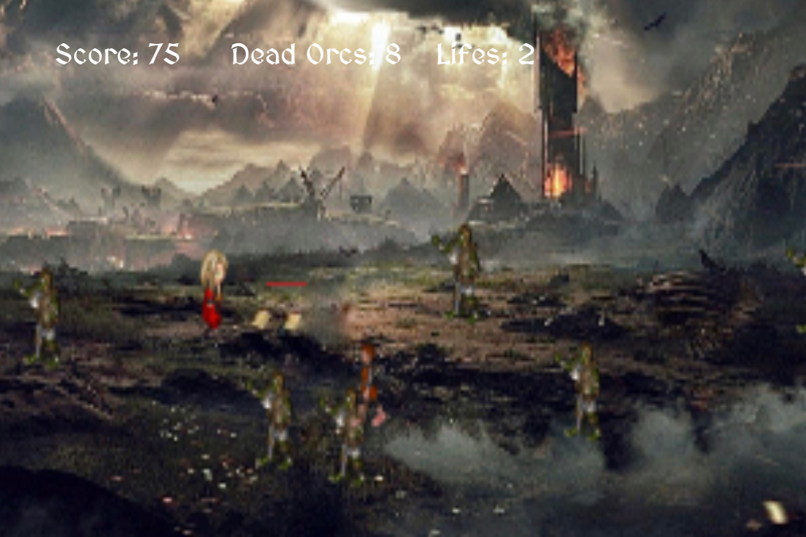

# SAVE THE HOBBITS

## Description

**Save-The-Hobbits** , is a game set in The Lord of The Rings. In this game the orcs want to invade The Shire so Legolas (the player) has to save the hobbits. For the sake of that, he has to move across the screen throwing arrows to the orcs and avoiding killing the hobbits.

At the top of the screen you can see: your score, the amount of dead orcs and the lifes you have left. The lifes decrement every time you kill a hobbit and the game ends when in the course of the fight, you kill three of them.
 
 

 

## MVP (DOM - CANVAS)

- The game has a main player that moves in all directions.
- He throws arrows to the right side.
- Orcs appear randomly from the half of the right side of the screen
- Hobbits appear randomly from the same side of the orcs.
- Three killed hobbits will end the game.

## GAME

TRY THE GAME:

https://save-the-hobbits.netlify.app/

## BUILT WITH

- HTML5
- CSS3
- JavaScript
